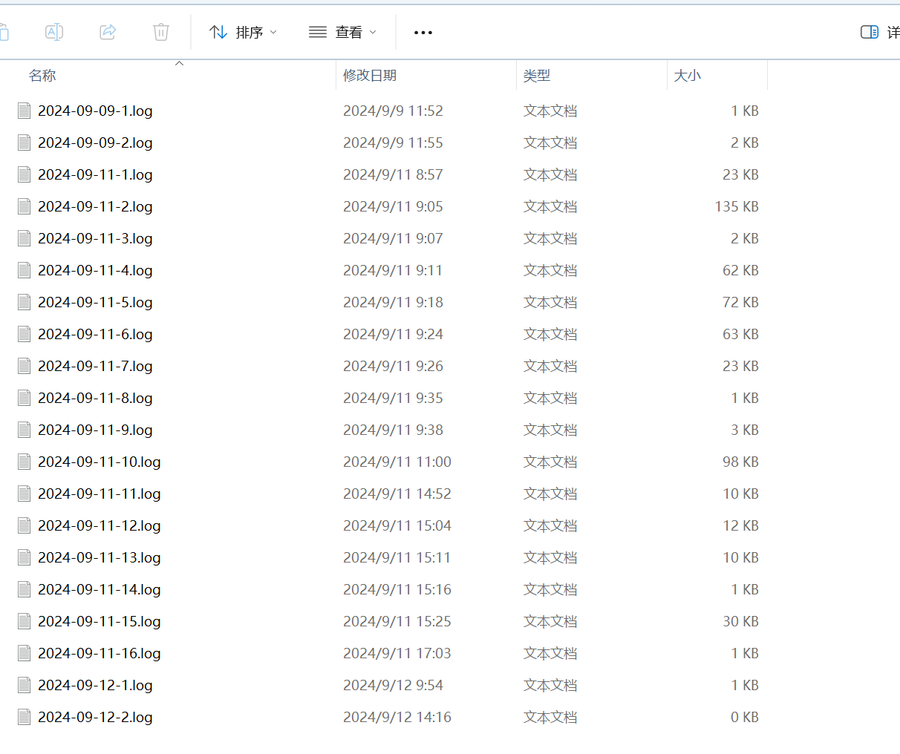

# env-monitor-sys

## 1. 项目介绍

本项目是使用C++开发后端逻辑部分，Vue开发前端web部分，OpenHarmony 开发搭载Hi3861芯片的wfi IoT开发板，使用MySQL作为数据库的环境检测预警系统，主要功能有使用物联网技术链接多个检测模块，将检测模块发送到后端的数据保存到数据库，并且集成了一个阈值警告模块，和一个前端web可视化实时监控模块。

## 2.功能介绍

### 2.1 tcp服务器

实现了tcp服务器接收多个客户端的功能，程序可以同时响应多个数据采集模块发来的信息。

获取到的数据数量可能不一，但是程序都能很好的识别并保存到数据库。

### 2.2 http服务器

通过多线程的方式可以与tcp服务器同时运行，响应web前端的Get或Post请求然后在对应api接口发送数据。

### 2.3 配置信息

通过一个esys.conf的配置文件将程序需要的一些配置信息提前导入，比如http和tcp的端口号，数据库登录的信息、警告响应的阈值等等。

### 2.4 日志模块

程序将不同模块的控制台数据保存到日志文件中，并且为每一行日志添加了时间信息；此外，对于可能会刷屏的日志信息，在配置文件中可以设置开启和关闭。

### 2.5 数据库读写

程序完成了多种数据库读写的代码，并且使用共享锁和独占锁保证在多线程环境下对数据库读写的安全性。

### 2.6 web服务器

通过Vue3和echarts+element plus等组件的使用，使web服务器的界面简洁但高级，且动态实时的刷新数据。

### 2.7 警告模块

通过在配置文件中设置好的阈值信息，系统会实时的判断是否有超过阈值的采集到的数据，该判断是区分ip的，且能做到web端到板子的及时反馈。且有一个警告延时模块，通过设定好的延时时间，能保证在设定时间内警告模块能一直运行。

### 2.8 其他方面

**可用性设计**：程序启动时如果没有配置文件程序会自动用默认配置创建，没有数据库程序也可以通过搜索建表文件进行自动创建，报错信息会显示到控制台和日志文件中，方便排查问题。

**小体量的程序**：主程序的大小不到500KB，web服务器的大小也不到3MB，在其他windows(10+)平台上可移植，未来会做linux的移植。

## 3. 成果展示

### 3.1 web页面

1. 在网页打开127.0.0.1:5050（默认端口5050，可以在配置文件中调整）：


2. 如果数据库中有信息，程序会读取所有存在的ip地址，然后在页面左上角的下拉菜单中进行选择，选择好后，如果这个ip与服务器在发送信息，则数据会实时的渲染到界面上，如果有数据超过系统设定的阈值，则会在右上角弹出提示框:
   

3. 点击右边的**Table**,再次选择IP,即可看到实时渲染的数据表格，且超过阈值的数据会被标红：


### 3.2 控制台界面

1. 控制台界面输出日志信息，并且将信息同步到`logs`文件夹下的以日期-次数命名的日志文件中。重启一次系统日志就会新建一个。
   

2. 下图是日志文件目录：
   

### 3.3 数据库

通过查询数据库，可以看到数据已经保存在了数据库中：


### 3.4 开发版

在开发板上，可以看到采集的数据成功通过tcp传输到了系统：


如果系统返回的**response是{alarm_active}**,则会激活板子上的蜂鸣器，下面是实现该效果的代码逻辑：
```c
while (1)
  {
    if (overload_flag == 1 && beeper_flag == 0)
    {
      uint16_t freqDivisor = 34052;
      // 占空比，频率
      PwmStart(WIFI_IOT_PWM_PORT_PWM0, freqDivisor / 2, freqDivisor);
      beeper_flag = 1;
    }
    else if (overload_flag == 0 && beeper_flag == 1)
    {
      PwmStop(WIFI_IOT_PWM_PORT_PWM0);
      beeper_flag = 0;
    }

    if (AHT20_StartMeasure() != WIFI_IOT_SUCCESS)
    {
      printf("trigger measure failed!\r\n");
    }
    if (AHT20_GetMeasureResult(&temperature, &humidity) != WIFI_IOT_SUCCESS)
    {
      printf("get humidity data failed!\r\n");
    }
    char str[100] = {0};
    // 读取气味传感器数据
    AdcRead(GAS_SENSOR_CHAN_NAME, &smoke, WIFI_IOT_ADC_EQU_MODEL_4, WIFI_IOT_ADC_CUR_BAIS_DEFAULT, 0);
    OledShowString(0, 0, "Sensor values:", 1);               // 在0列0行输出提示信息
    snprintf(line, sizeof(line), "temp: %.2f", temperature); // 将温度值转为字符数组赋值给line数组变量
    OledShowString(0, 1, line, 1);                           // 0列1行在液晶屏上显示温度值
    snprintf(line, sizeof(line), "humi: %.2f", humidity);    // 将湿度值转为字符数组赋值给line数组变量
    OledShowString(0, 2, line, 1);                           // 0列2行在液晶屏上显示湿度值
    snprintf(line, sizeof(line), "gas: %d", smoke);          // 将气味值转为字符数组赋值给line数组变量
    OledShowString(0, 3, line, 1);                           // 在0列3行液晶屏上显示气味值

    // 将温度湿度气味数据传递给str数组变量，并用,号分隔
    snprintf(str, sizeof(str), "%.2f,%.2f,%d", temperature, humidity, smoke);
    printf("temp,humi,qiwei:%s\n", str);
    // strcpy(request, str);
    snprintf(request, sizeof(request), "[\"temperatureVal\":%.2f, \"humidityVal\":%.2f, \"smokeVal\":%d]", temperature, humidity, smoke);
    printf("The %d-th data collection.\r\n", i++);
    contact_to_server(request, strlen(request) + 1, response, sizeof(response));
    if (!strcmp(response, "ack"))
    {
      overload_flag = 0;
    }
    else if (!strcmp(response, "stop"))
    {
      close_conent();
      break;
    }
    else if (!strcmp(response, "alarm_active"))
    {
      overload_flag = 1;
    }
    usleep(3000*1000);
  }
```

### 3.5 配置文件

通过在`configs/esys.conf`中编写配置，可为对系统行为进行方便的更改（需要重启系统）：


## 4. 部署流程

### 4.1 在windows平台上编译C++代码

1. 安装Visual Studio 2022（以下简称VS），这是Microsoft提供的一个强大的C/C++ IDE工具。

2. 准备`mysql-connector-c++`，这是一个专门为C++程序提供的链接MySQL的工具，[下载链接：MySQL :: Download Connector/C++](https://dev.mysql.com/downloads/connector/cpp/) ,**下载**下图中箭头指的文件，
   
   选择下载**Windows(x86, 64-bit),ZIP Archive**或者**下面的Debug版本**，具体下载哪个取决于你在VS中选择生成项目的方法，**使用Release生成则选择不带Debug的版本，使用Debug生成则选择带Debug的版本**。如果都要用则建议都下载下来。
   下载好后将其保存到**项目根目录**`.\lib`下解压缩并保存即可，如果没有`.\lib`文件夹，请手动新建一个。**解压缩后保证命名如下**:

   ```
   .\lib
   ├───mysql-connector-c++-9.0.0-winx64
   └───mysql-connector-c++-9.0.0-winx64(debug)
   ```

   **如果你下载的是Debug版本的mysql-connector，请修改命名，命名规范务必与上面展示的保持一致！**

3. 使用VS打开`.\env-monitor-sys.sln`，在解决方案资源管理器右键env-monitor-sys项目，然后打开属性。


打开属性后，配置属性->常规中**将C++语言标准改到ISO C++17以上**。


配置属性->VC++ 目录中检查外部包含目录和库目录是否如下图所示，**注意检查你的生成方式**！（**也就是下图中左上角的配置是Release还是Debug**），然后选择正确的目录（我这里使用的是Release，所以选择不带(debug)的数据库连接工具）。**设置完成后一定要点击右下角的应用按钮！**


我在这里也附一张选择Debug生成的设置图片：


在链接器->输入->附加依赖项中添加`mysqlcppconn.lib`。**注意这里Debug和Release的配置信息不共享**，所以这里如果两个生成方式都用的话都得改。


退出到解决方案资源管理器，右键点击生成，或者使用顶部的本地Windows调试器：


如果出现下面错误:


如果选择的是`Release`方法生成，则将**项目根目录`.\lib\mysql-connector-c++-9.0.0-winx64\lib64`下面的`mysqlcppconn-10-vs14.dll`拷贝到`x64\Release`文件夹下**，这里就是VS的生成文件位置。不放心的话建议也把`libcrypto-3-x64.dll`和`libssl-3-x64.dll`也拷贝过去。

`Debug`方法也是同理，**将`.\lib\mysql-connector-c++-9.0.0-winx64(debug)\lib64\debug`下面的`mysqlcppconn-10-vs14.dll`拷贝到`x64\Debug`文件夹下**，也可以把`.\lib\mysql-connector-c++-9.0.0-winx64(debug)\lib64`下的`libcrypto-3-x64.dll`和`libssl-3-x64.dll`也拷贝过去。

> **注意！Release的下的dll拷到Release下，Debug下的dll拷到Debug下，不要弄混了！**


到这里程序就算生成完成了，如何运行请先往下看，下面会讲。

### 4.2 web服务器的构建

在项目根目录`.\webapp`下就是Vue项目的目录，建议使用VSCode打开。

1. **安装node.js**：[Node.js — 在任何地方运行 JavaScript (nodejs.org)](https://nodejs.org/zh-cn)下载并安装node.js，网上教程很多这里就不赘述了，但是一定要确保将node.js添加到系统的环境变量中。

2. 在项目根目录下打开终端，输入命令：
   ```cmd
   cd .\webapp
   npm install
   npm run build
   ```

   项目构建成功的话，如图所示：
   

这时``.\webapp\dist`这个文件夹就是生成的web网页了。我们将其拷贝到刚才的VS生成的.exe文件夹下，这里我选择Release生成，所以**也就是说将`.\webapp\dist`拷贝到`.\x64\Release\`下**（如果你用Debug生成则拷贝到`.\x64\Debug\`下）。

### 4.3 构建数据库

1. 检查你的MySQL，**确保没有一个名为envdb的数据库**。或者将你的数据库删了之后按照我下面的建表方式重新建库。最简单的方法是让本程序帮你建库，只要在`.\x64\Release\`新建一个文件`envdb.sql`,用任何的文本编辑器打开并将下面代码拷贝到其中，**别忘了保存**:
   ```sql
   CREATE DATABASE IF NOT EXISTS envdb;
   USE envdb;
   
   CREATE TABLE envtable(
     eid BIGINT PRIMARY KEY AUTO_INCREMENT COMMENT '主键自增',
     temperatureVal FLOAT COMMENT '温度值',
     humidityVal FLOAT COMMENT '湿度值',
     smokeVal INT COMMENT '气味值',
     noiseVal INT COMMENT '噪音值',
     clientIP CHAR(16) COMMENT '采集设备ip地址',
     etime DATETIME COMMENT '录入信息时间',
     note VARCHAR(150) COMMENT '备注'
   );
   ```

2. 启动程序，在`.\x64\Release\`打开终端，输入下面命令:
   ```cmd
   .\env-monitor-sys.exe
   ```

   

项目成功运行！

## 5. 默认配置文件介绍

如果系统成功运行，将在`.\config`下新建一个默认配置文件`esys.conf`，以下是对配置文件的介绍：

```ini
# tcp server's ip address and port
tcp_server_ip = 127.0.0.1	#tcp服务器的ip
tcp_server_port = 8080	#tcp服务器的端口号
# the database settings
db_url = tcp://127.0.0.1:3306	#数据库链接的url
db_user = root	#数据库登录用户名
db_password = 1234	#数据库登录密码
db_schema = envdb	#本项目使用的数据库名称
db_build_file_location = ./envdb.sql	#默认建表文件位置，以env-monitor-sys.exe的所在目录为根目录
suffix_of_collected_values = Val	#数据库中采集数据的后缀，以应对采集数据类型不一的情况
# the http server settings	
hs_host = 127.0.0.1	#http服务器的ip
hs_port = 5050	#http服务器的端口号
hs_mount_dir = ./dist	#http服务器的静态目录，也就是我们使用vue生成的dist文件夹
# alarm program settings
prefix_of_threshold_value = threshold_	#设有阈值的数据在本文件中的前缀，原因同上
threshold_temperature = 38.0	#温度的阈值，超过阈值则会激活报警模块
threshold_humidity = 40.0
threshold_smoke = 	#留空或者干脆不写这说明没有设阈值
alarm_lock_duration_seconds = 60
# log settings
log_operations = false	#日志选项，false则会关闭对普通的tcp收到请求和数据库查询的结果在日志上的输出，还控制台一片宁静ヽ(￣▽￣)ﾉ
```

